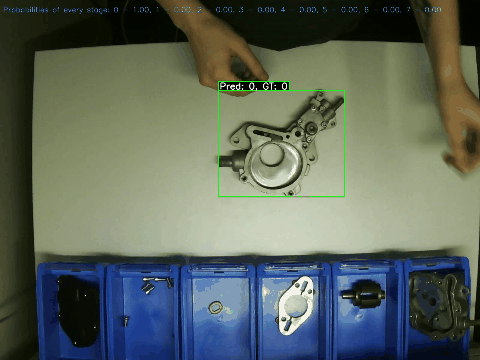

# Data Science Lab FS 2025

Authors: Yi-Yi Ly, Georg Ye, Owen Du



Rejected frames are shown in red, accepted frames in green. Only green frames are classified.

## Repo Structure

```
.

```

## Downsample the videos

Run `dslab25/obj_detection/preprocessing/downsample.ipynb` to downsample the original videos to 5fps. Hereby, change `DATA` path to the path of the original folder, which contains the `.avi` files.

## Run whole pipeline (extract seedfram -> frame rej -> inference)

Run `dslab25/obj_detection/dino/pipeline.py` to:

1. obtain the seedframe using cosimilarity search on DINO features on bounding boxes of YOLO and reference object
2. perform SAM tracking starting seed frame that was found
3. frame rejection based on IoU and scale difference
4. inference using DINO

Results can be analyzed in `dslab25/obj_detection/dino/final_results.ipynb`.

<<<<<<< HEAD
To **test** the frame rejection framework and obtain the confusion matrix for a video, run (from home directory):
=======

## Frame Rejection using IoU and Scale Threshold from SAM

Run `dslab25/obj_detection/dino/inference.py` to obtain the results.

If using the student cluster, you can simply run the following instead (from home directory):

> > > > > > > cleaned

```
./obj_detection/dino/test_frame_rejection.py
```

<<<<<<< HEAD

## Analysis of Results

# The final results, statistics can be performed in:

Frame rejection logic: 0. We use two references: the render and a "clean image" (frame 70, in 5fps video). Ideally, we could have a static image in the database of the object to be tracked, instead of hard-coding the clean image, but this is minor and can be adapted for future uses.

1. Perform terative scale-adaptive ICP to match the segmentation of the current object with the reference object's render.
2. Calculate the IoU btw. current cropped object and cropped reference object.
3. Reject frames based on IoU (the higher the IoU, the better it matches) and the scale that was used to scale the current object to the clean-image-object-size.
4. Perform classification on ACCEPTED frames only using DINO.
5. Obtain metrics on ACCEPTED frames only.

For example,

the clean image object was rescaled with 0.65 with respect to the countour of the render reference object. Thus, in a video setting, we would reject objects where the scale varies too much (`scale_threshold`).

Similarly, if the object does not look alike to the render reference object, then its IoU will be small. We reject based on an `iou_threshold`.

The output video can be found in: `/work/courses/dslab/team14/videos/sam_boxed_5fps_0.6iouthresh_0.1scaletol.mp4`, where red = rejected and green = accepted.

To **test** the framerejection framework and obtain the confusion matrix for a video, run (from home directory):

> > > > > > > cleaned

```
./obj_detection/dino/final_results.ipynb
```

The masks and contours can be analyzed using:

```
./obj_detection/dino/play_masks_analysis.ipynb
```

## Blender

### Textures given to us by the challenger giver:

They are wrong lol.

```json
{
    # Gehaeuse_1_1_bottom
    "case_bottom": {
      "color": [0.59, 0.51, 0.43, 1.0] ,
      "roughness": 0.65,
      "metallic": 1.0
    },
    # rotor/roter
    "axel": {
      "color": [0.30, 0.20, 0.15, 1.0],
      "roughness": 0.9,
      "metallic": 0.2
    },
    # Gehaeuse_teil_2_1
    "case_upper": {
      "color": [0.59, 0.51, 0.43, 1.0] ,
      "roughness": 0.65,
      "metallic": 1.0
    },
    # abstandplatte 1
    "diamond": {
      "color": [0.30, 0.20, 0.15, 1.0],
      "roughness": 0.65,
      "metallic": 0.9
    },
    # Abdeckplatte
    "cover_top": {
      "color": [0.01, 0.01, 0.01, 1],
      "roughness": 0.5,
      "metallic": 0
    }
  }
```

### Install the blender add on (no longer needed):

https://blendermarket.com/products/physics-dropper

### Run the blender script

`/Applications/Blender.app/Contents/MacOS/Blender --python blender_new.py`

### Generate annotations

This is old, dont use this anymore. If you need to create annotations from scratch write a new script

`python3 annotation.py --root /Users/georgye/Documents/repos/ethz/dslab25/training vacuum_pump/generated/output/stages --output-dir ./anno`

### Useful commands

Zip folder without .git and venv:
`zip -r dslab25.zip dslab25 -x "dslab25/.git/*" "dslab25/venv/*" "dslab25/obj_detection/dino/yolo_runs/*"`

Send data on runpod:
`runpodctl send data.txt`

```
sudo apt update
sudo apt install pkg-config libcairo2-dev libgirepository1.0-dev python3-dev python3-setuptools zip unzip
```

## Installing SAM2

apt update
apt install -y python3-setuptools
pip install --upgrade pip setuptools wheel
pip install --no-build-isolation iopath

## Preprocessing

### Augment images

We do the following

1. Rotation (20 degrees increements)
2. SAM features
3. Tint patches
4. Brightness
5. Obscure
6. Scale
7. Translate

This can quite some time, and be be pretty big (around 100GB (I think)).

First go to `obj_detection/preproccessing/augment.ipynb` and run the Rotate (Images) cell.
Then go to roboflow and annotate them manually, then put them in `obj_detection/preproccessing/stage_0/labels` and run the rest of the cells (You dont need to do it now because I already did it).

## Training YOLO

run all cells of `obj_detection/dino/yolo.ipynb`

## Training Dino

run all cells of `obj_detection/dino/dino.ipynb`

## Inference

run all cells of `obj_detection/dino/inference.ipynb`

## Qwen 2.5 VL (expenrimental)

### Testing model weights

Put the yolo model weights in `obj_detection/dino/yolo_runs/yolov12_boundingbox2/weights/best.pt`
Put the dino model weights in `obj_detection/dino/dinov2_finetune/base/final_model/`

# TODO:

- augment with scale and shear
- randomize objects in each render in blender

```

```
